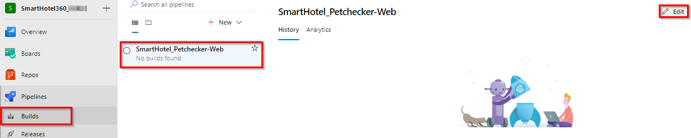
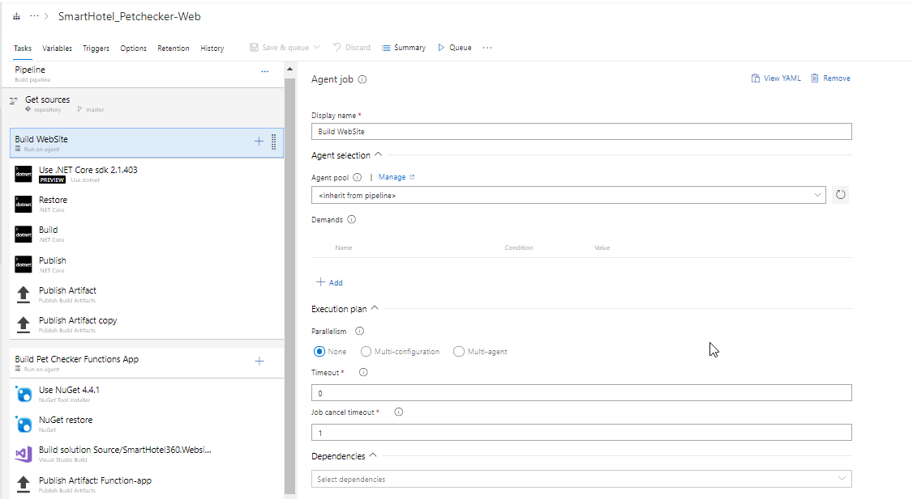
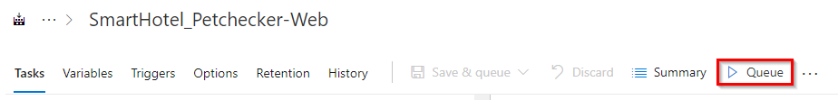
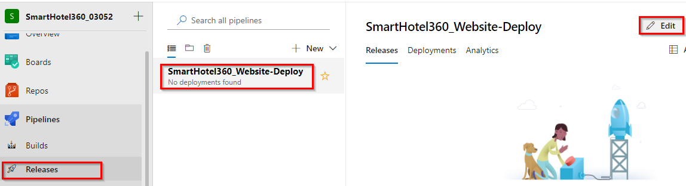
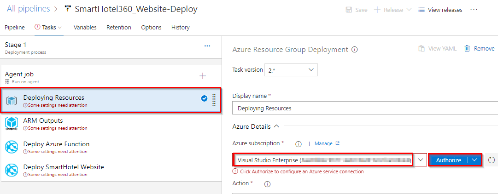
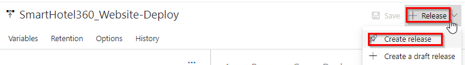
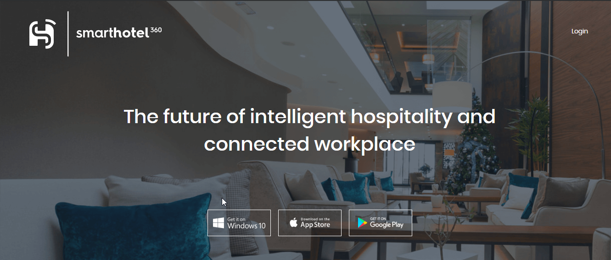

**What is SmartHotel360 ?**                  
**SmartHotel360** is a fictitious smart hospitality company showcasing the future of connected travel.  
Their vision is to provide:
- Intelligent, conversational, and personalized apps and experiences to guests 
- Modern workplace experiences and smart conference rooms for business travelers
- Real-time customer and business insights for hotel managers & investors
- Unified analytics and package deal recommendations for campaign managers.

----------

**What is the intent of this demo?**          
There’s never been a better time to be a developer. Our intent with these set of reference apps and Azure backend is to show developers how to get started building the apps of the future, today!

------

**Where is the code for the SmartHotel360 applications?**                         

The entire code for the SmartHotel360 application is maintained on GitHub at https://github.com/microsoft/SmartHotel360. The build and release pipelines in this project are set to point to this repo.

--------
**How can I deploy the application to my subscription?**  
**SmartHotel360** has multiple apps that share a common backend, including a public website where hotel guests can book a room, smart conference rooms, and even verify if their pets are allowed in the hotel. In this demo we are going to build and deploy public website of **SmartHotel360**

Please follow the steps below to deploy the "Public Web" application.

### Build and Deploy SmartHotel360 Public Web

1. Navigate to **Pipelines \| Builds**. Select **SmartHotel_Petchecker-Web** pipeline and click **Edit**.
  

1. The build pipeline has two agent jobs to build Website project and Pet Checker function app project.
    

    - The SmartHotel360.Website project: An ASP.NET Core website which is a web app developed using React+Redux and server-side rendering.

    - The SmartHotel360.WebsiteFunction project: An Azure Function used to analyze photos of pets using the Cognitive Services Vision API and Azure Cosmos DB.

1. Click on **Queue** to trigger the build. Once the build process starts, select the build number to see the build in progress. 
      
      

1. Once the build is success navigate to **Pipelines \| Releases**. Select **SmartHotel360_Website-Deploy** pipeline and click **Edit**. Then click on **Tasks**.
     
     

1. Select **Azure Resource Group Deployment** task. Select your Azure subscription from **Azure subscription** dropdown. Click **Authorize**.
   
    

    You will be prompted to authorize this connection with Azure credentials. Disable pop-up blocker in your browser if you see a blank screen after clicking the OK button, and please retry the step.

   This creates an **Azure Resource Manager Service Endpoint**, which defines and secures a connection to a Microsoft Azure subscription, using Service Principal Authentication (SPA). This endpoint will be used to connect** Azure DevOps** and **Azure**.

   > If your subscription is not listed or to specify an existing service principal, follow the [Service Principal creation](https://docs.microsoft.com/en-us/azure/devops/pipelines/library/connect-to-azure?view=vsts) instructions.

1. Update the **Azure Subscription** in all the other tasks and **Save** the changes.

1. Click **Create Release** to trigger the deployment.
     
     

   Once the deployment is success, navigate to your **Azure portal**. You will see a website https://smarthotel360xxxx.azurewebsites.net/ under the resource group **Website**. Browse the website. The deployed application will look like as below
   
    

